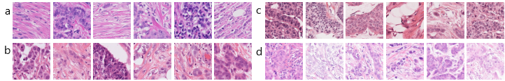
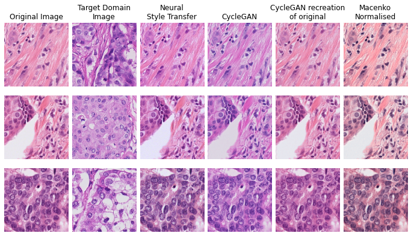
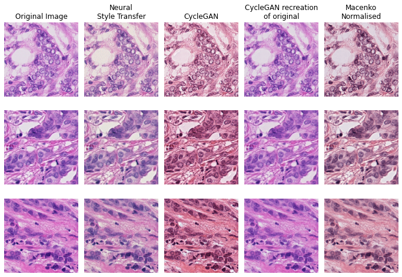
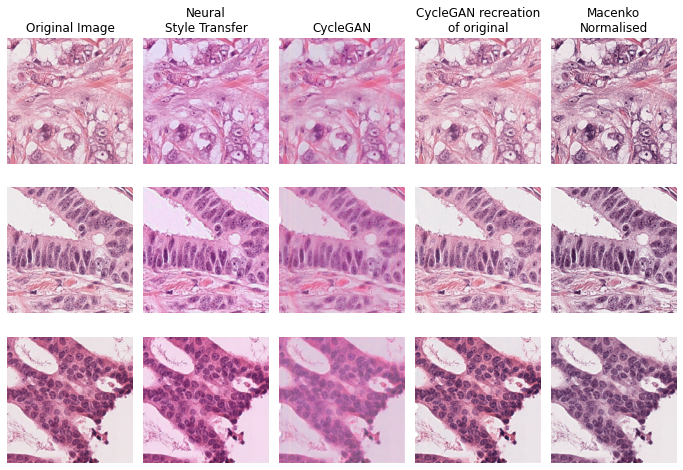

[Our Paper](doi.org/10.1007/978-3-030-97281-3_2) | [MIDOG Challenge Website](https://imig.science/midog/) | [MIDOG Challenge Paper](https://arxiv.org/abs/2204.03742)

# MIDOG Domain Adaptation 
This repository contains the work we completed as part of the MIDOG challenge at the MICCAI 2021 conference, detailed at https://imi.thi.de/midog/. The corresponding paper for this work will be linked here when published. 

The challenge focuses on accurate detection of mitotic figures (dividing cells) in H&E-stained breast cancer cells, when images are digitised using different scanners, with the training scanners labelled a-d below.  




Our work focuses on evaluating two visual domain adaptation approaches - CycleGAN and Neural Style Transfer. These are both tested using two baseline mitosis detection models, one based on RetinaNet detection and the other on U-Net segmentation. 

## Example Notebook 
The most straight-forward way to recreate this work is to follow the notebook 'MIDOG_Demo_Notebook.ipynb', which has examples of baseline model creation, and mitosis detection evaluation with/without domain adaptation techniques.

## Domain Adaptation Examples
Below are some examples of the domain adaptation techniques, CycleGAN and Neural Style Transfer, as well as Macenko normalisation.
For more examples, please see the notebook "Domain_Adaptation_Examples.ipynb".

Images from scanner (a) adjusted to the domain of scanner (b).


Images from scanner (b) adjusted to the domain of scanner (c).


Images from scanner (c) adjusted to the domain of scanner (a).


## Using This Code
- Enable GPU

In Google Colab, this is achieved in Runtime -> Change runtime type

- Clone the repo
```bash
git clone https://github.com/scjjb/MIDOG_Domain_Adaptation
```

- Import required functions, e.g.
```bash
from MIDOG_Domain_Adaptation.code.segmentation_funcs import mask_segmentor
```

- Preparing the dataset

We use non-overlapping 512x512 patches generated from the original MIDOG images. The following code creates segmentation masks from the originally provided bounding-box annotations, and generates the 512x512 patches (typical runtime of 20 minutes on Google Colab):
```bash
from MIDOG_Domain_Adaptation.code.data_funcs import get_bbox_df
from MIDOG_Domain_Adaptation.code.segmentation_funcs import mask_segmentor

df = get_bbox_df(image_folder="/path/to/input/images/",annotation_file="/path/to/annotation/file/named/MIDOG.json")
image_ids=list(df['file_name'].unique())
mask_segmentor(image_ids,df,512,512,categories=["mitotic figure"],input_folder="/path/to/input/images/",
    image_folder='/path/to/output/image/patches/',mask_folder='path/to/output/segmentation/mask/patches/')
```
If using Google Drive to store data, it is recommended that after preparing the dataset you ensure the Drive is fully updated with the following command:
```bash
drive.flush_and_unmount()
```
This is because when processing large amounts of data, Google Drive does not process all uploads/changes immediately, and changes can be lost if the Colab session is disconnected before the Google Drive is fully updated. 


## Requirements
The requirements.txt file was automatically generated, meaning it contains strict package versions and many irrelevant packages. The main requirements should be clear from the Colab Example Notebook.


## Also See
References for model implementations:
* RetinaNet: https://github.com/ChristianMarzahl/ObjectDetection
* U-Net: https://github.com/sneddy/pneumothorax-segmentation and https://amaarora.github.io/2020/09/06/siimacr.html
* Neural style transfer: https://www.coursera.org/projects/deep-learning-with-pytorch-neural-style-transfer 
* CycleGAN: https://github.com/junyanz/pytorch-CycleGAN-and-pix2pix

